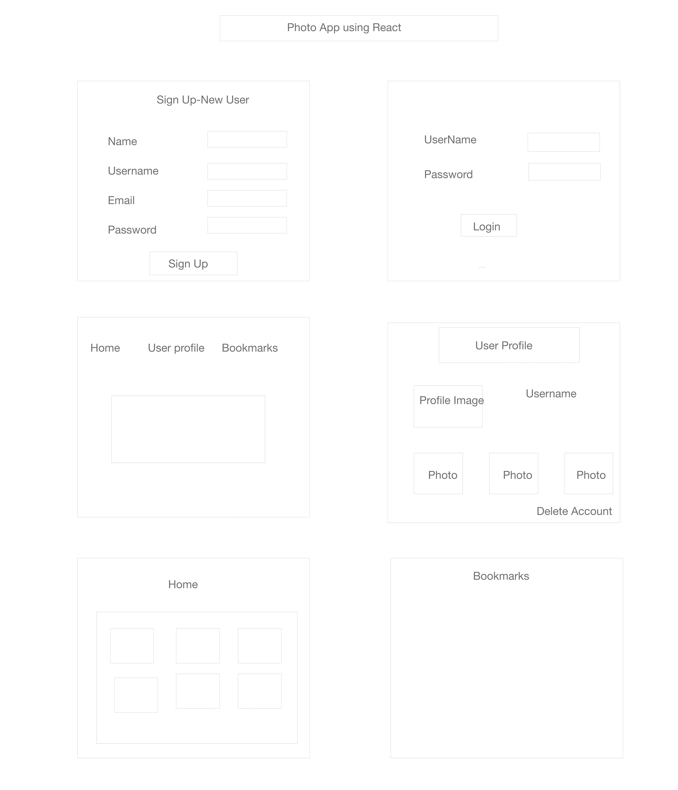

#### Requirements

1. Navigation Bar
    - Home (Photo-Grid)
    - User Profile (Maximum of 3 ppl.)
    - Bookmarks (Saved Images)
2. User is logged in or user is logged out
3. User Profile
    - Profile Image
    - Username
    - Grid Photos
4. Use a node library (SASS/Bootstrap/etc.)

### Wireframe

#### Note:
1. This project was bootstrapped with [Create React App](https://github.com/facebook/create-react-app).

